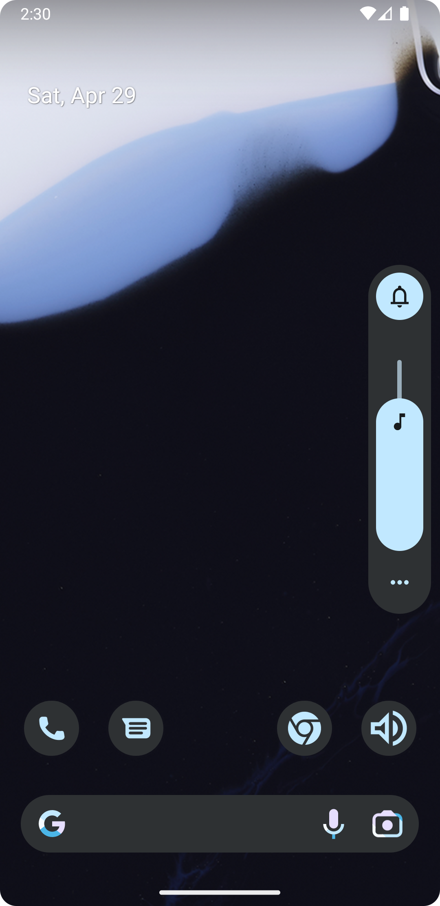
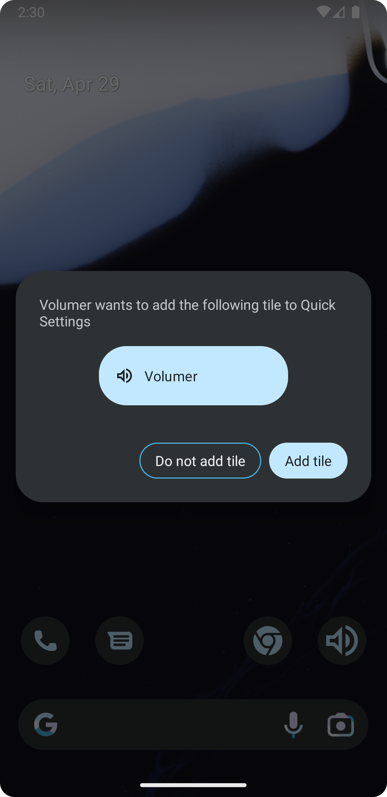
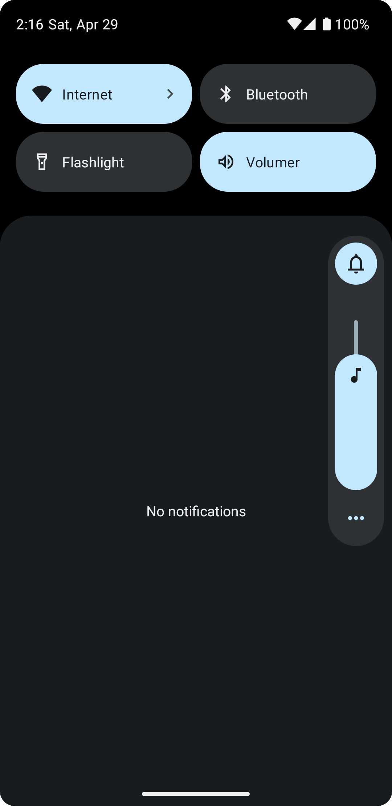

# Volumer

 

Are your volume buttons broken?

Volumer is a simple Android application that allows you to invoke the volume dialog.

The volume dialog can be invoked by tapping the app icon or the quick settings tile.

[Download APK](https://github.com/matth3wdsouza/Volumer/releases/latest/download/volumer.apk) (Requires Android 6+)

## Screenshots

  
